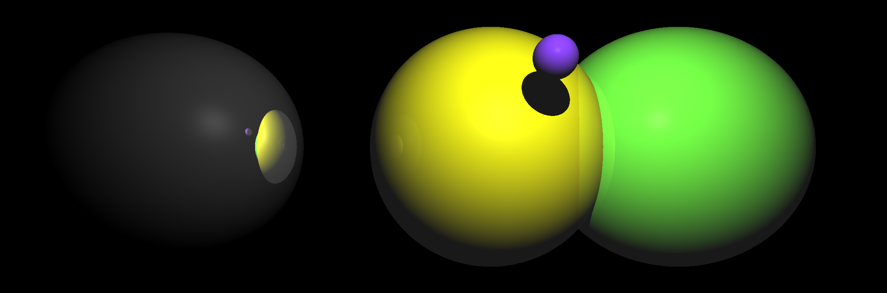

# Raytracer in Rust

This is a simple raytracer written in Rust. I'm by no means a Rust expert. This project's aim was to
write a very simple raytracer to learn more about the Rust language.

See my [Pathtracer](https://github.com/NHollmann/Pathtracer) for a more stable and feature-rich Raytracer.

## Features

- [x] Scene is loaded from a JSON file
- [x] Can output in multiple file formats: PNG, BMP, TIFF, others...
- [x] Spheres with materials
- [x] Phong BRDF
- [x] Reflections
- [ ] Transmissions/Refractions
